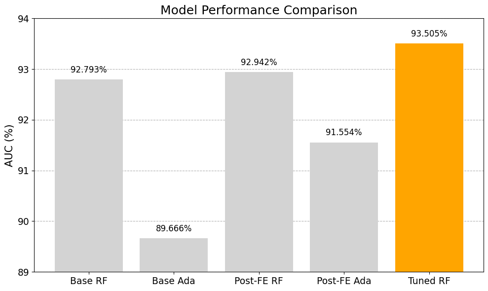

# Advertisements Tracking Fraud Detection

Detecting fraudulent clicks in mobile app advertisements using machine learning algorithms in Python.

This was the final project for the elective master's course _Application of Machine Learning Algorithms_ at the [Faculty of Organizational Sciences](https://en.fon.bg.ac.rs/), Information Engineering.

# Project Overview

The project is based on the [TalkingData AdTracking Fraud Detection Competition](https://www.kaggle.com/competitions/talkingdata-adtracking-fraud-detection/overview), with the objective to predict whether a mobile app click resulted in an app download. The dataset contained over 200 million clicks collected over four days, with ~185 million training samples and ~19 million test samples on a fifth day. Due to extreme data size (7.5 GB), Polars library was used for data manipulation and scikit-learn for modelling.

The dataset was highly imbalanced — only 0.2449% of clicks resulted in downloads and thus AUC (Area Under the ROC Curve) metric was used to evaluate model performance.

The best model, with optimized hyperparameters using grid search, was Random Forest, achieving AUC of **93.504%** on a sample test set.

# Dataset

The dataset contains click-level event logs:
| Column | Description |
|---------|--------------|
| `ip` | IP address of click |
| `app` | App ID for marketing |
| `device` | Device type ID (e.g., iphone 6 plus...) |
| `os` | OS version ID of user mobile phone |
| `channel` | Channel ID of mobile ad publisher  |
| `click_time` | Timestamp of click (UTC) |
| `attributed_time` | Timestamp of download (if occurred) |
| `is_attributed` | Target label (1 = downloaded, 0 = not downloaded) |

Additional columns (`click_id`, `attributed_time`, `is_attributed`) differ between training and test sets.

Train set contains 184,903,890 rows and test set 18,790,469 rows, provided by the competition organizers. 

However, due to hardware and time constraints, the train set was randomly sampled to 100 million rows. Here is how each subset was generated:
* <u>**sampled train set**</u>: 900,000 random records from 8th November;
* <u>**sampled test set**</u>: 100,000 random records from 9th November, ranging between 04 PM and 15 PM

EDA, preprocessing, feature engineering and modelling was performed on the sampled train set [train set], while evaluation is done on the sampled test set [test set].

# Data Exploration

Exploratory Data Analysis revealed:
- For `app` the five apps are dominating with a total share of 63.30%.
- For `ip` instance 5348 had total of 5206 clicks in the 3rd day, suggesting a high traffic, which might indicate it is a proxy address or coming from Tor.
- Device type 1 dominates heavily (~95%).
- Almost 60% is the share of the top 5 operating systems.
- `channel` column is more diverse, but some channels occur more frequently. 
- Daily patterns showed activity peaks in the early afternoon.  

# Feature Engineering

The following columns were added in the feature engineering phase:

- `click_timestamp` – Normalized UNIX timestamp in seconds  
- `previous_sessions` – Count of sessions per IP (15-minute threshold)  
- `total_sessions` – Total sessions per (IP, previous_sessions) across dataset  
- `current_session_duration_till_now` – Cumulative duration of the current session per (IP, previous_sessions)
- `current_session_duration` – Total session duration session per (IP, previous_sessions)  
- `avg_previous_sessions_duration` – Average duration of previous sessions  

Insights gained from analyzing the derived columns:
* Only 25% of IPs had one session.
* IPs with **11** or more total sessions usually **do not download** according to the 3rd quantile.
* There were 27.71% IPs with total sessions of 11 or more, however such IPs contribute to **69.39%** of the total application clicks.

# Hyperparameter Optimization

Grid search without cross validation was used to optimize hyperparameters of Random Forest:

| Hyperparameter     | Values           |
|--------------------|------------------|
| `n_estimators`     | [300, 400]       |
| `max_depth`        | [6, 10, None]    |
| `max_features`     | ['sqrt', 6, 12]  |
| `min_samples_leaf` | [20]             |

If hardware and time were less constrained, the search space could have been expanded and refined further.

# Results

The best configuration of hyperparameters:

| Hyperparameter        | Value  |
|-----------------------|--------|
| `max_depth`           | 10     |
| `max_features`        | 12     |
| `n_estimators`        | 400    |
| `min_samples_leaf`    | 20     |

Tuned Random Forest achieved:
- Train AUC: 98.665%  
- Test AUC: **93.505%**

The top three most important features were `app`, `device`, and `channel` in that order, contributing heavily to the model's predictions.

Below is the comparison plot between base models with original features, base models after feature engineering and the tuned RandomForest model: 

The tuned model was saved locally and it's available in `models/rf_model.joblib`.

# Conclusion

RandomForest turned out to be a winner for the used preprocessing, but AdaBoost also performed decently; however, it fit the training set less well. Even the base model achieved the excellent value for AUC, but adding the extra features bumped up the performance.

Solving the challenge of high number of clicks for particular IP addresses is crucial, because one IP can be shared by multiple users (router IP or proxies).

Future improvements could include:
- Using a tree-based ensemble model which natively supports categories, such as LightGBM.  
- Generating additional features, such as click-delta (`previous_click_timestamp`, `next_click_timestamp`).
- Utilizing `attributed_time` column during ETA analysis, potentially squeezing more performance and increasing the AUC metric.

# Report
The report in English is available as PDF in this repository: [link](https://raw.githubusercontent.com/aleksa-radojicic/AdTracking_Fraud_Detection/refs/heads/main/Report.pdf).